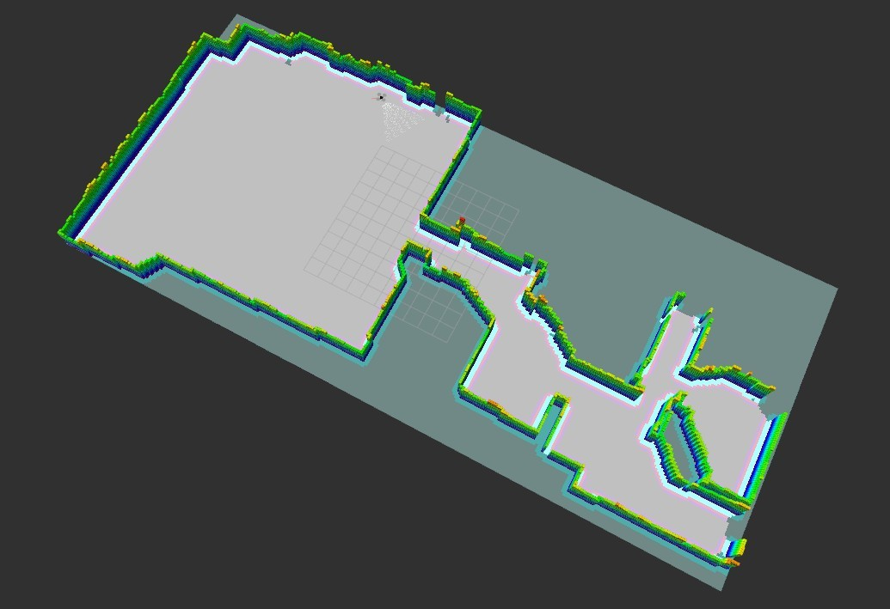
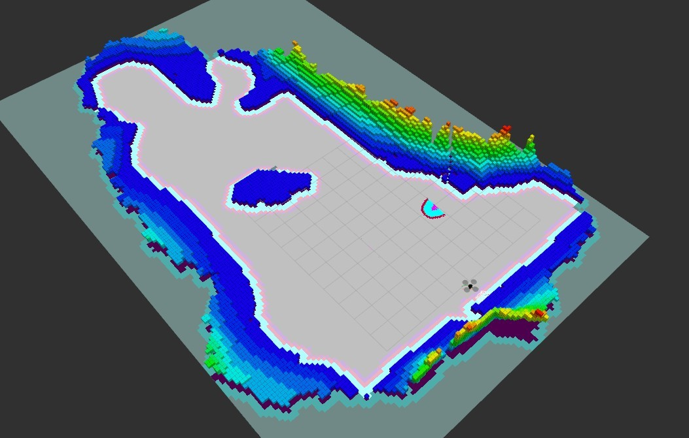

# Caltech Samaritan

Autonomous SLAM & exploration using drones, a project for Caltech's *ME 134
Autonomy* class.
[`CS134_Final_Project_Report.pdf`](./CS134_Final_Project_Report.pdf) contains a
detailed description of the project and the approach used. This repository can
be cloned as a ROS package.

# Demo

There are two videos showing the whole setup in action: [exploring indoor
environment](https://www.youtube.com/watch?v=5fQLEVJwjwE) and [exploring
outdoor environment](https://www.youtube.com/watch?v=hfpO-X9Q2aM).  Images of
the final 3D occupancy grid can be seen below.

Indoor environment             |  Outdoor environment
:-------------------------:|:-------------------------:
  |  

# Prerequisites

This project was developed for ROS Kinetic (Ubuntu 16.04). The following
packages are required:

1. Drone simulation is done using
   [hector\_quadrotor](http://wiki.ros.org/hector_quadrotor) and Gazebo. [This
   page](https://answers.ros.org/question/244776/is-it-possible-to-run-the-hector_quadrotor-demos-in-kinetic/)
   contains the instructions for installing `hector_quadrotor` on ROS Kinetic.

2. [OctoMap](http://wiki.ros.org/octomap) is used to generate the 3D occupancy
   grid. `octomap_server` is used to interface OctoMap with ROS, both can be
   installed via `apt` as `ros-kinetic-octomap` and `ros-kinetic-octomap-ros`.

3. You'll need to install the [OctoMap RViz
   plugin](https://github.com/OctoMap/octomap_rviz_plugins) via `apt` as
   `ros-kinetic-octomap-rviz-plugins`. Without it, occupancy grid
   visualisations in RViz will not work.

3. To control the drone manually, you might need to install the
   `ros-kinetic-teleop-twist-keyboard` package and then run
   `teleop_twist_keyboard teleop_twist_keyboard.py`. *There is a better tool* described in the next section, but it
   requires [pynput](https://pypi.org/project/pynput/) Python package to be installed (and available to ROS).
   
4. Robot navigation is handled using the standard ROS navigation stack, namely `move_base`, so make sure you have that
   installed. Additionally, [TEB local planner](http://wiki.ros.org/teb_local_planner) is used, which can be installed
   via `apt` as `ros-kinetic-teb-local-planner`. Make sure you have `ros-kinect-pointcloud-to-laserscan` installed for
   costmaps to work correctly.
   
5. The scripts in this repo are written in Python 2.7 (default version for ROS
   Kinetic). Packages [pynput](https://pypi.org/project/pynput/), [numpy](http://www.numpy.org/) are required for Python
   scripts to work, all of which can be installed using `pip`. `ros_numpy` is also required, it can be installed via
   `apt` as `ros-kinetic-ros-numpy`.

# Usage

1. Make sure you have the [prerequisites](#prerequisites) installed.
2. Clone this repo into your [catkin
   workspace](http://wiki.ros.org/catkin/Tutorials/create_a_workspace), e.g.
   into `~/catkin_ws/src/caltech_samaritan/`.
3. Source appropriate ROS files in your Bash instance, i.e. run `source
   /opt/ros/kinetic/setup.bash` and `source ~/catkin_ws/devel/setup.bash`.
4. Run `catkin_make` in `~/catkin_ws/` and `source
   ~/catkin_ws/devel/setup.bash` again.
5. Start the simulation using `roslaunch caltech_samaritan full_indoors.launch`. This launch file will:
   1. Initialize Gazebo with a sample indoors environment (if you want to try outdoors, use `full_outdoors.launch`),
   2. Spawn a simulated quadrotor with a Kinect attached to it and activate its
      motors,
   3. Launch RViz with a custom config,
   4. Start an OctoMap server, generating occupancy grid in real time, and
   5. Initialise the navigation stack.
6. (Optional) If you want to control the drone manually, you can use the script mentioned in the previous section.
   Alternatively, you can use `roslaunch caltech_samaritan teleop.launch` but it requires [pynput](https://pypi.org/project/pynput/)
   package to be installed.
7. (Optional) If you want to test the navigation stack manually, you can do the following: First, using teleop
   instructions from the step above, fly around for a bit to make sure the navigation stack has something to work with;
   Second, start the hover script using `rosrun caltech_samaritan force_hover.py`. Now you can issue "2D Nav Goals"
   using rviz interface to see the navigation stack in action.
8. Start the exploration script with `rosrun caltech_samaritan start_exploration.py`.
9. ???
10. Profit!
